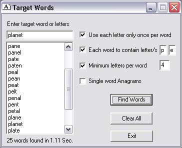



## Target Words

### Description

Make words and anagrams from target word or letter string. No frills interface.
 
### More Info
 
Dictionary word or letter string.

VB5 users can emulate the VB6 Replace function in separate BAS module with sample code provided.

             |
---                |---
**Submitted On**   |2006-11-23 23:54:42
**By**             |[Ken Francis](https://github.com/Planet-Source-Code/PSCIndex/blob/master/ByAuthor/ken-francis.md)
**Level**          |Intermediate
**User Rating**    |5.0 (10 globes from 2 users)
**Compatibility**  |VB 5\.0, VB 6\.0
**Category**       |[Complete Applications](https://github.com/Planet-Source-Code/PSCIndex/blob/master/ByCategory/complete-applications__1-27.md)
**World**          |[Visual Basic](https://github.com/Planet-Source-Code/PSCIndex/blob/master/ByWorld/visual-basic.md)
**Archive File**   |[Target\_Wor20328611252006\.zip](https://github.com/Planet-Source-Code/ken-francis-target-words__1-67178/archive/master.zip)

